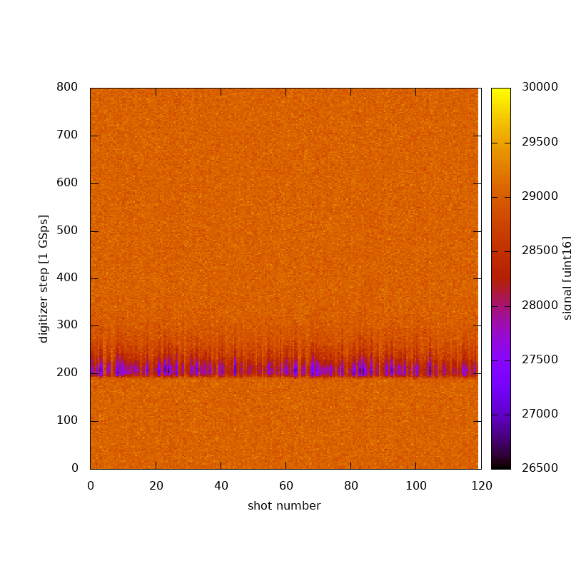

# gasEnergyMonitors
GDET algorithm development

```bash
ssh centos7.slac.stanford.edu
ssh lcls-prod02
coffee@lcls-prod02 $ ls /nfs/slac/staas/fs1/g/coffee_group/stefan-GDET_data/
data_access.notes
coffee@lcls-prod02 $ ssh physics@lcls-srv01
Select Profile [0..398]:51
Selected Profile: coffee
rsync -pruv /u1/lcls/matlab/data/2022/2022-*/2022-*/GDET* coffee@lcls-prod02:/nfs/slac/staas/fs1/g/coffee_group/stefan-GDET_data/
```

Then exit back out completely and then into sdf to work on files via gpfs:
```bash
ssh -Y sdf.slac.stanford.edu
srun --x11 --partition ml -n 1 --pty /bin/bash
cd gasEnergyMonitors/ 
module load slac-ml
```

The map of hte 120 shots from one of the 2022 runs is... 


... and the power spectra (in this case photon energy is over 10keV...  


